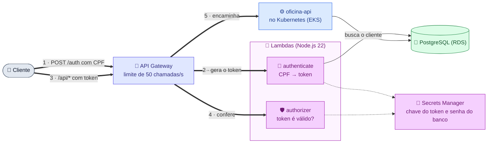

# oficina-auth-lambda

**Autenticação por CPF** e **API Gateway** da Oficina Mecânica
(Tech Challenge 13SOAT — Fase 3).

## Links

| O quê | Link |
|---|---|
| 🚪 API em produção (API Gateway) | https://q7m1gn8vqi.execute-api.us-east-1.amazonaws.com |
| 🪪 Login por CPF | `POST https://q7m1gn8vqi.execute-api.us-east-1.amazonaws.com/auth` |
| 📘 Swagger | [abrir no Swagger Editor](https://editor.swagger.io/?url=https://raw.githubusercontent.com/Lorenalgm/oficina_mecanica/main/openapi.yaml) |
| 📝 Por que JWT (RFC-003) | [RFC-003](https://github.com/Lorenalgm/oficina_mecanica/blob/main/docs/rfcs/RFC-003-estrategia-de-autenticacao.md) |
| ⚙️ Código da API | [oficina_mecanica](https://github.com/Lorenalgm/oficina_mecanica) |
| ☸️ Kubernetes | [oficina-infra-k8s](https://github.com/Lorenalgm/oficina-infra-k8s) |
| 🐘 Banco de dados | [oficina-infra-db](https://github.com/Lorenalgm/oficina-infra-db) |

> O ambiente roda no AWS Academy Learner Lab e fica fora do ar entre as sessões.

## O que faz

| Rota | Acesso | O que acontece |
|---|---|---|
| `POST /auth` | público | Lambda **authenticate** confere o CPF, busca o cliente no banco e devolve um token JWT válido por 1 hora |
| `ANY /api/*` | com token | Lambda **authorizer** confere o token e, se válido, o Gateway encaminha a chamada para a API no Kubernetes |

A API confere o token de novo, por segurança
([ADR-001](https://github.com/Lorenalgm/oficina_mecanica/blob/main/docs/adrs/ADR-001-api-gateway-lambda-authorizer.md)).

## Arquitetura

Leia pelos números: **(1 → 2)** é o login, **(3 → 5)** é uma chamada protegida.



**Legenda:** 🟪 autenticação e segredos · 🟦 aplicação · 🟩 banco

Passo a passo com todos os casos de erro:
[sequencia-auth.md](https://github.com/Lorenalgm/oficina_mecanica/blob/main/docs/arquitetura/sequencia-auth.md).

## Respostas do login

| Status | Quando |
|---|---|
| **200** + `token` | CPF válido e cliente cadastrado |
| **400** | CPF com dígitos inválidos |
| **404** | CPF válido, mas cliente não cadastrado |

## Testar

```bash
API=https://q7m1gn8vqi.execute-api.us-east-1.amazonaws.com

curl -X POST "$API/auth" -H 'Content-Type: application/json' -d '{"cpf":"11111111111"}'   # 400
curl -X POST "$API/auth" -H 'Content-Type: application/json' -d '{"cpf":"<CPF cadastrado>"}' # 200
curl "$API/api/clientes"                                                                  # 401 sem token
curl "$API/api/clientes" -H "Authorization: Bearer $TOKEN"                                 # 200
```

## Stack

| Item | Escolha |
|---|---|
| Funções | AWS Lambda, Node.js 22 |
| Token | JWT HS256 (biblioteca `jose`) |
| Banco | PostgreSQL via `pg` |
| Entrada | AWS API Gateway (HTTP API) |
| Infraestrutura como código | Terraform |

## Rodar localmente

```bash
npm ci
npm test         # testes da validação de CPF
npm run build    # gera a pasta build/ para o deploy
```

## Deploy

Pré-requisito: [oficina-infra-db](https://github.com/Lorenalgm/oficina-infra-db)
já aplicado (rede, banco e segredo vêm de lá).

```bash
npm run build
cd terraform
cp terraform.tfvars.example terraform.tfvars   # preencha tfstate_bucket e backend_base_url

terraform init \
  -backend-config="bucket=<bucket do state>" \
  -backend-config="region=us-east-1" \
  -backend-config="dynamodb_table=<tabela de trava>"

terraform apply
terraform output auth_endpoint
```

`backend_base_url` é o endereço do Load Balancer do cluster, obtido com
`make nlb` no [oficina-infra-k8s](https://github.com/Lorenalgm/oficina-infra-k8s).
É para lá que o Gateway encaminha as chamadas `/api/*`.

## CI/CD

| Workflow | Quando roda | O que faz |
|---|---|---|
| `ci.yml` | pull request | Testes + validação do Terraform |
| `cd.yml` | push em `main` ou `develop` | Testes, build, deploy na AWS e teste rápido do `/auth` |

- `main` = produção, `develop` = homologação. A `main` só recebe código por pull request.
- Secrets: `AWS_ACCESS_KEY_ID`, `AWS_SECRET_ACCESS_KEY`, `AWS_SESSION_TOKEN`,
  `TFSTATE_BUCKET`, `TFSTATE_LOCK_TABLE`.
- Variables: `AWS_REGION`, `BACKEND_BASE_URL`.
