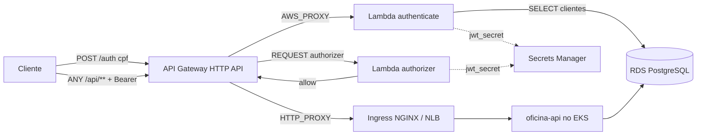

# oficina-auth-lambda

Função serverless de autenticação e API Gateway da oficina mecânica (Tech Challenge 13SOAT — Fase 3).

## Propósito

Autentica o cliente pelo **CPF** e devolve um **JWT** consumido pelas rotas protegidas da `oficina-api`.

- `POST /auth` (público) → valida o CPF, consulta o cliente no RDS e assina um JWT HS256 válido por 1h.
- `ANY /api/{proxy+}` (protegido) → um **Lambda Authorizer** valida o JWT antes de o Gateway encaminhar a requisição ao Ingress do cluster.

O mesmo token é revalidado dentro da `oficina-api` (middleware `ValidarJwt`), como defesa em profundidade.

## Tecnologias

Node.js 22 · `jose` (JWT) · `pg` (PostgreSQL) · AWS Lambda · AWS API Gateway HTTP API · AWS Secrets Manager · Terraform · GitHub Actions.

## Arquitetura



VPC, subnets, RDS e o segredo vêm do repositório **oficina-infra-db**, lido via `terraform_remote_state`.

## Execução local

```bash
npm ci
npm test          # validação de CPF, mesmos casos do DocumentoTest da oficina-api
npm run build     # gera build/ com src + dependências de produção
```

## Deploy

Pré-requisito: `terraform apply` já executado em **oficina-infra-db**.

```bash
npm run build
cd terraform
cp terraform.tfvars.example terraform.tfvars   # ajuste tfstate_bucket e backend_base_url

terraform init \
  -backend-config="bucket=<bucket-do-state>" \
  -backend-config="region=us-east-1" \
  -backend-config="dynamodb_table=<tabela-de-lock>"

terraform apply
terraform output auth_endpoint
```

### `backend_base_url`

Para onde o Gateway encaminha `/api/*`. O cluster **kind** local não é alcançável pela AWS, então:

| Momento | Valor |
|---|---|
| Desenvolvimento | URL pública do Railway |
| Gravação do vídeo | URL do NLB criado pelo Ingress no EKS |

## Verificação

```bash
API=$(terraform -chdir=terraform output -raw api_url)

curl -X POST "$API/auth" -H 'Content-Type: application/json' -d '{"cpf":"11111111111"}'   # 400
curl -X POST "$API/auth" -H 'Content-Type: application/json' -d '{"cpf":"52998224725"}'   # 404 ou 200
curl "$API/api/clientes"                                                                  # 401
curl "$API/api/clientes" -H "Authorization: Bearer $TOKEN"                                 # 200
```

## CI/CD

- `ci.yml` — `npm test` + `terraform fmt -check` / `validate` em todo PR.
- `cd.yml` — em `develop` (homologação) e `main` (produção): testes, build, `terraform apply` e smoke test do endpoint de autenticação.

Secrets: `AWS_ACCESS_KEY_ID`, `AWS_SECRET_ACCESS_KEY`, `TFSTATE_BUCKET`, `TFSTATE_LOCK_TABLE`.
Variables: `AWS_REGION`, `BACKEND_BASE_URL`.

## Repositórios relacionados

| Repositório | Papel |
|---|---|
| `oficina-api` | Aplicação Laravel no Kubernetes |
| `oficina-infra-db` | Terraform da VPC e do RDS |
| `oficina-infra-k8s` | Terraform do EKS |

## Swagger

A documentação das rotas protegidas fica na `oficina-api`: `openapi.yaml`, publicado no ReadMe.io.
